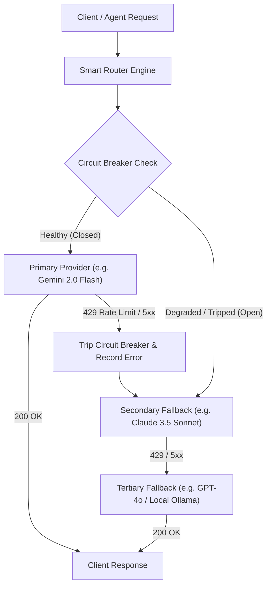

# OmniRoute AI Gateway Resilience & Smart Routing

This skill provides the architectural blueprints and operational patterns from OmniRoute (supporting 358 providers, 19 routing combo strategies, and automatic circuit-breaker failovers).

---

## 1. Gateway Resilience Architecture



---

## 2. Circuit Breaker State Machine

Each provider + model endpoint maintains a discrete circuit state:

1. **Closed (Healthy)**:
   - All requests pass through normally.
   - Consecutive failures are tracked within a rolling time window (e.g., 60 seconds).
   - If error rate exceeds threshold (e.g., 3 consecutive 429s or 5xx errors), the breaker transitions to **Open**.
2. **Open (Tripped / Cooling Down)**:
   - Requests immediately bypass this provider and route to the next fallback candidate.
   - A cooldown timer is set (e.g., base $30\text{s}$, doubling up to $10\text{m}$ upon repeated trips).
   - Prevents overwhelming downstream APIs and eliminates client-side waiting timeouts.
3. **Half-Open (Testing Recovery)**:
   - After cooldown expires, a single probe request is permitted through.
   - If the probe succeeds, the circuit breaker resets to **Closed**.
   - If the probe fails, the circuit immediately returns to **Open** with increased cooldown.

---

## 3. Top Routing Combo Strategies

OmniRoute defines 19 routing modes. The most effective patterns are:

| Strategy | Description | Best Use Case |
|---|---|---|
| **Priority Cascade** | Tries providers strictly in user-defined order (P1 $\to$ P2 $\to$ P3) | Production reliability with preferred pricing tier |
| **Auto-Combo** | Evaluates real-time p50/p95 latency and health metrics to auto-select fastest healthy provider | Low-latency interactive applications |
| **Least Cost / Free-First** | Routes to free-tier providers first (e.g., Google AI Studio, Groq, OpenRouter free), falling back to paid | Budget-conscious scaling and development |
| **Round Robin with Jitter** | Distributes load uniformly across identical models across multiple API keys/accounts | Circumventing strict per-minute rate limits |
| **Model Lockout Guard** | Temporarily isolates a specific model ID across all providers if a provider deprecates or breaks it | Protecting against upstream API deprecations |

---

## 4. Exponential Backoff with Decorrelated Jitter

Standard linear or fixed retry intervals cause thundering herds. OmniRoute uses decorrelated jitter:

$$\text{sleep} = \min(\text{cap}, \text{random}(\text{base}, \text{previous\_sleep} \times 3))$$

```javascript
export async function fetchWithRetry(fn, maxRetries = 3, baseMs = 500, capMs = 8000) {
  let attempt = 0;
  let sleepMs = baseMs;
  while (attempt < maxRetries) {
    try {
      return await fn();
    } catch (err) {
      attempt++;
      if (attempt >= maxRetries || (err.status && err.status < 500 && err.status !== 429)) {
        throw err;
      }
      const jitteredSleep = Math.min(capMs, Math.floor(Math.random() * (sleepMs * 3 - baseMs) + baseMs));
      await new Promise((r) => setTimeout(r, jitteredSleep));
      sleepMs = jitteredSleep;
    }
  }
}
```
